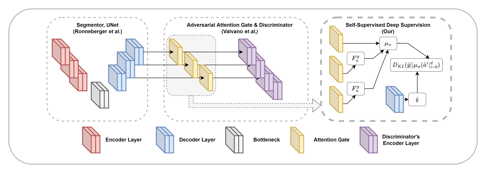

# OCTAve: 2D en face Optical Coherence Tomography Angiography Vessel Segmentation in Weakly-Supervised Learning with Locality Augmentation

[](https://doi.org/10.1109/TBME.2022.3232102)
[](https://opensource.org/licenses/Apache-2.0)




This repository contains the implementation used in the experiment for replication study (`experimentation` branch) and ease-of-use implementation (`main` branch).

For an additional information about our work, please visit [the project homepage](iobt-vistec.github.io/OCTAve).

---


## Installation
> Usage of virtual python environment such as `conda` or `virtualenv` is highly recommended.

`pip install -r requirements.txt`

## Usage

For `main` branch

- Download resnest50 pretrained weight from this [github release](https://github.com/zhanghang1989/ResNeSt/releases/download/weights_step1/resnest50-528c19ca.pth).


```python
# Import model's torch nn.module
from architectures.models.octa import OctaScribbleNet
# Import losses
from architectures.segmentor.losses import WeightedPartialCE, DiceLoss, InterlayerDivergence
from architectures.discriminator.losses import LSDiscriminatorialLoss, LSGeneratorLoss

# Use as you see fit (PyTorch training loop, PyTorch Lightning's LightningModule, Pytorch Ignite, etc.)
...
```

For `experiment` branch

> Special Requirement: As our experiment is resource intensive and the high-performance cluster were used, SLURM job submitter package `submitit` is required in our implementation. If your machine does not have job scheduler like SLURM available, a modification to the train script to use `LocalExecutor` is mandatory (We will update the codebase to make this process automatic at the later date). Please refer to their [repo](https://github.com/facebookincubator/submitit). We will try to response to any inquiries as soon as possible.

- Download resnest50 pretrained weight from this [github release](https://github.com/zhanghang1989/ResNeSt/releases/download/weights_step1/resnest50-528c19ca.pth).

- Download [ROSE](https://imed.nimte.ac.cn/dataofrose.html) and [OCTA-500](https://ieee-dataport.org/open-access/octa-500) datasets. Both datasets required an email request to the dataset owner for an access.
- Prepare datasets.
- Train the model.

---
## Citation

```bibtex
@ARTICLE{9999313,
    author={Chinkamol, Amrest and Kanjaras, Vetit and Sawangjai, Phattarapong and Zhao, Yitian and Sudhawiyangkul, Thapanun and Chantrapornchai, Chantana and Guan, Cuntai and Wilaiprasitporn, Theerawit},
    journal={IEEE Transactions on Biomedical Engineering},
    title={OCTAve: 2D en face Optical Coherence Tomography Angiography Vessel Segmentation in Weakly-Supervised Learning with Locality Augmentation},
    year={2022},
    volume={},
    number={},
    pages={1-12},
    doi={10.1109/TBME.2022.3232102}
}
```
