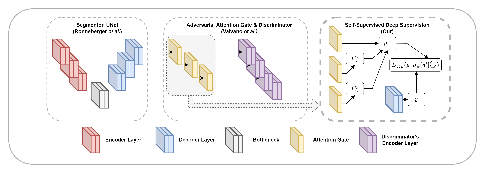

# TL;DR

In this work, we tried to lessen the expert clinician works on the segmentation labelling task of 2D en face OCTA images by adopting the scribble-like ground truth training technique proposed by Valvano *et al.* Which is working to some degree, but we found some problems with the original technique such as performance issue and segmentation artifacts. To solve these issues, we proposed a new deep-supervision technique called **Self-Supervised Deep Supervision (SSDS)** to enhance the model learning and suppress segmentation artifacts in the prediction results. In our experiment, we found that SSDS significantly improve not just weakly-supervised learning from scribble-like ground truth, but also a generic fully-supervised learning as well.
# Abstract

**Objective**: 

While the microvasculature annotation within Optical Coherence Tomography Angiography (OCTA) can be leveraged using deep-learning techniques, expensive annotation processes are required to create sufficient training data. One way to avoid the expensive annotation is to use a type of weak annotation in which only the center of the vessel is annotated. However, retaining the final segmentation quality with roughly annotated data remains a challenge. 

**Methods**: 

Our proposed methods called OCTAve provide a new way of using weak-annotation on microvasculature segmentation. Since the centerline labels are similar to scribble annotations, we attempted to solve this problem by using the scribble-based weakly-supervised learning method. Even though the initial results look promising, we found that the method could be significantly improved by adding our novel self-supervised deep supervision method based on Kullback-Liebler divergence. 

**Results**: 

The study on large public datasets with different annotation styles (i.e., ROSE, OCTA-500) demonstrates that our proposed method gives better quantitative and qualitative results than the baseline methods and a naive approach, with a p-value less than 0.001 on dice-coefficients and a lot fewer artifacts visually seen. 

**Conclusion**:

The segmentation results are both qualitatively and quantitatively superior to baseline weakly-supervised methods when using scribble-based weakly-supervised learning augmented with self-supervised deep supervision, with an average drop in segmentation performance of less than 10%. Significance: This work gives a new perspective on how weakly-supervised learning can be used to reduce the cost of annotating microvasculature, which can make the annotating process easier and reduce the amount of work for domain experts.

## Keywords

Optical Coherence Tomography Angiography,
Vessel Segmentation,
Deep Neural Network,
Self-Supervised Learning,
Weakly-Supervised Learning

# Citation

```bibtex
@ARTICLE{9999313,
    author={Chinkamol, Amrest and Kanjaras, Vetit and Sawangjai, Phattarapong and Zhao, Yitian and Sudhawiyangkul, Thapanun and Chantrapornchai, Chantana and Guan, Cuntai and Wilaiprasitporn, Theerawit},
    journal={IEEE Transactions on Biomedical Engineering},
    title={OCTAve: 2D en face Optical Coherence Tomography Angiography Vessel Segmentation in Weakly-Supervised Learning with Locality Augmentation},
    year={2022},
    volume={},
    number={},
    pages={1-12},
    doi={10.1109/TBME.2022.3232102}
}
```
---
